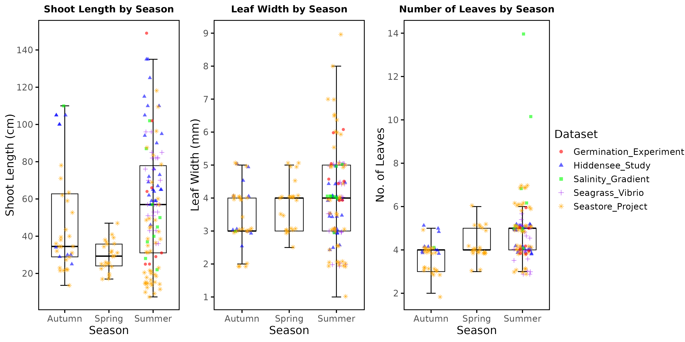
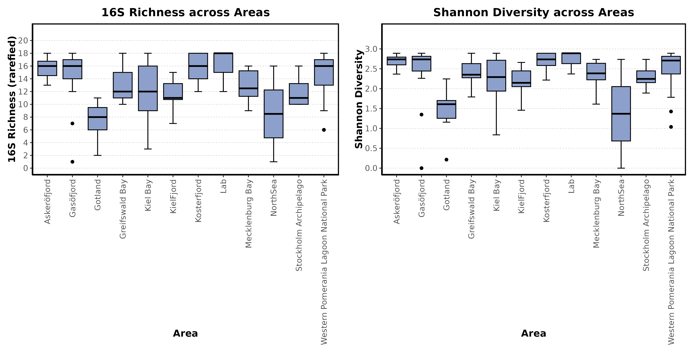
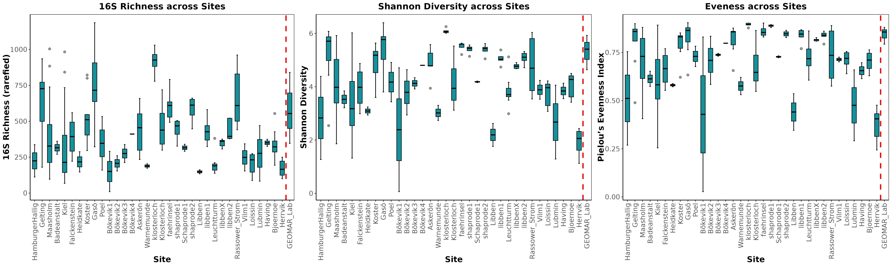
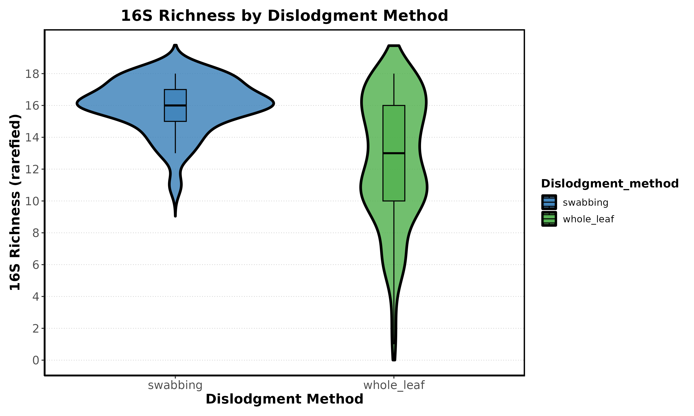
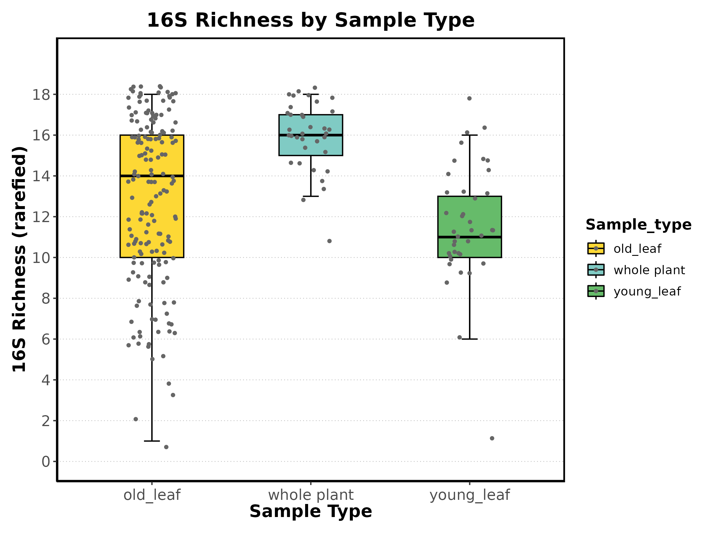
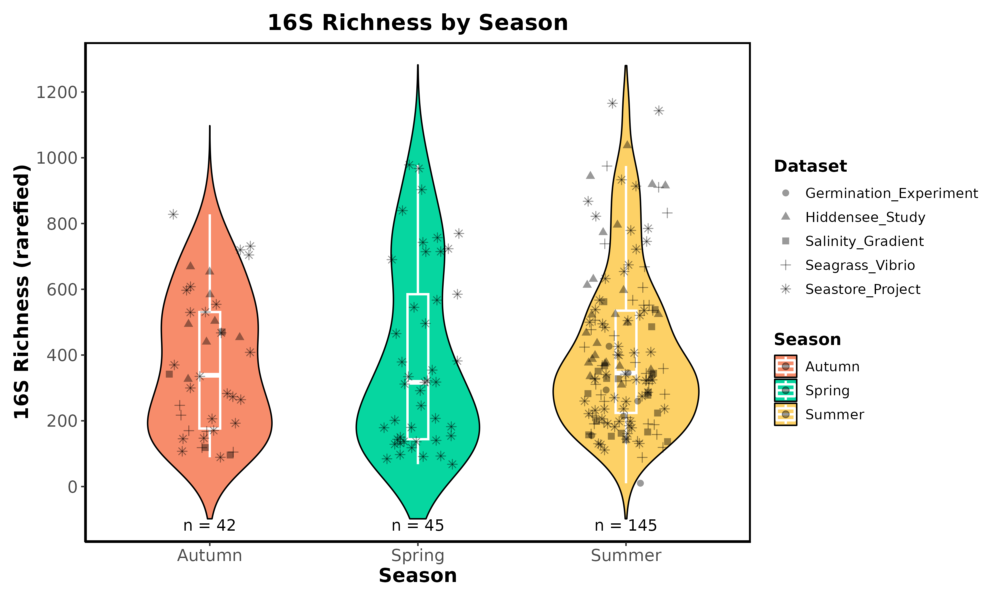

# Data Analysis Comments

## 1. Overview of the Data

### 1.1 Sample Data

|       | Julian_day         | Depth              | Latitude           | Longitude          | Shoot_Length      | Leaf_Width         | No_leaves          | Salinity           | Temperature        |
| ----- | ------------------ | ------------------ | ------------------ | ------------------ | ----------------- | ------------------ | ------------------ | ------------------ | ------------------ |
| count | 240.0              | 116.0              | 237.0              | 237.0              | 202.0             | 231.0              | 203.0              | 113.0              | 46.0               |
| mean  | 200.72083333333333 | 3.1340517241379304 | 55.25981583122363  | 11.83454112236287  | 49.92821782178218 | 3.8212121212121213 | 4.714285714285714  | 12.942654867256637 | 13.697826086956523 |
| std   | 41.31460559276722  | 1.299290762015135  | 1.5868292742030643 | 2.2697253229037035 | 30.10111559381344 | 1.3032835798825853 | 1.4486739778848965 | 4.916023730345475  | 6.821973944718306  |
| min   | 131.0              | 0.2                | 54.012013          | 8.811733           | 7.4               | 1.0                | 2.0                | 3.8                | 5.0                |
| 25%   | 170.75             | 2.5                | 54.349             | 10.15              | 27.475            | 3.0                | 4.0                | 9.31               | 7.5                |
| 50%   | 203.0              | 3.0                | 54.5787            | 11.038             | 40.45             | 4.0                | 4.0                | 14.0               | 18.8               |
| 75%   | 239.25             | 3.4                | 54.687             | 13.153746          | 65.0              | 4.5                | 5.0                | 15.0               | 20.6               |
| max   | 274.0              | 7.1                | 59.22              | 18.902             | 149.0             | 9.0                | 14.0               | 25.5               | 20.8               |

### 1.2 ASV counts
#### 1.2.1 Prokaryotes 

- Samples: 240
- ASVs: 38,607

#### 1.2.1 Eukaryotes

- Samples: 240
- ASVs: 849

### 1.3 Taxonomy
#### 1.3.1 Prokaryotes

- **Kingdom**: The dataset contains 1 kingdom, with all sequences classified under as *Bacteria*.
- **Superphylum**: 44 unique superphyla are represented, with *Proteobacteria superphylum* being the most frequent.
- **Phylum**: 121 unique phyla are identified, with *Proteobacteria* being the most common (6,173 occurrences).
- **Class**: 283 unique classes, with *Bacteroidia* being the most frequent.
- **Order**: 618 unique orders, with *Woesearchaeales* being the most frequent.
- **Family**: 1,061 unique families, with many unclassified at this level, particularly *Woesearchaeales_unclassified*.
- **Genus**: 1,863 unique genera, with a significant number of unclassified genera.
- **Species**: 1,929 unique species, again with a high number of unclassified species.

#### 1.3.2 Eukaryotes

- **Kingdom**: The dataset contains 1 kingdom, with all sequences classified under *Eukaryota*.
- **Superphylum**: 7 unique superphyla are represented, with *SAR* being the most frequent.
- **Phylum**: 25 unique phyla are identified, with *Metazoa* being the most common.
- **Class**: 62 unique classes, with *Ochrophyta* being the most frequent.
- **Order**: 127 unique orders, with *Bacillariophyta* being the most frequent.
- **Family**: 224 unique families, with many unclassified at this level, particularly *Bacillariophyta_unclassified*.
- **Genus**: 308 unique genera, with a significant number of unclassified genera, especially *Bacillariophyta_unclassified*.
- **Species**: 353 unique species, again with a high number of unclassified species, mostly under *Bacillariophyta_unclassified*.

## 2. Analysis Methodology

This analysis is conducted progressively, with the current focus on microbiome data derived from 16S rRNA gene sequencing. To address differences in sequencing depth across samples, the ASV table was first rarefied to the minimum sample size of 18 reads. Two key alpha diversity metrics were evaluated: Species Richness, which counts the number of unique ASVs, and the Shannon Diversity Index, which considers both species abundance and evenness. Given the non-normality of the data, the Kruskal-Wallis test was used to assess significant differences in Shannon Diversity and Species Richness across the sample variables.

## 3. Description of the figures

### 3.1. Sample Data

*Figure 1: Morphology metrics by Season.*

The median shoot length in Autumn is approximately 60 cm, showing significant variability with whiskers extending up to 140 cm. In Spring, the median shoot length drops to around 30 cm with reduced variability. During Summer, the shoot length increases again to a median of 50-60 cm, but with greater spread and some outliers exceeding 140 cm.

Leaf width in Autumn varies notably, with a median of 4-5 mm and a broad distribution. In Spring, the leaf width stabilizes with a slightly lower median, remaining within a similar range. By Summer, variability increases again, with outliers reaching up to 9 mm.

The number of leaves is relatively consistent across seasons, with a median of about 4 leaves in Autumn and Spring, but with slightly more variation in Spring. In Summer, while the median remains around 4 leaves, the variability increases, as seen by a wider interquartile range and more outliers.

These seasonal trends suggest that Zostera marina exhibits differential responses to environmental conditions throughout the year, with Summer showing the highest variability, potentially due to varying growth conditions as reported by previous studies [Abe et al.] (https://doi.org/10.1111/j.1444-2906.2008.01562.x). These findings indicate the influence of environmental factors and geographic locations on the morphological traits observed across different datasets.

### 3.2. 16S (Prokaryotes)

#### 3.2.1 Alpha Diversity

*Figure 2: Alpha diversity by area.*

Areas like Askeröfjord and Kosterfjord demonstrate consistently high 16S richness, with median values around 16-18 and a tight interquartile range (IQR), indicating stable and elevated diversity. In contrast, Gotland and the North Sea have lower median richness (~8-10) with wider IQRs, reflecting greater variability in diversity. These regions also show low outliers, hinting at samples with notably reduced richness.

Similarly, Askeröfjord and Kosterfjord maintain high Shannon diversity, with median values approaching 3 and minimal variation. Additionally, Mecklenburg Bay and the Stockholm Archipelago display relatively high and consistent diversity levels.

Overall, both diversity metrics highlight that areas such as Askeröfjord and Kosterfjord are characterized by consistently high microbial or genetic diversity, whereas regions like Gotland and the North Sea exhibit lower and more variable diversity profiles.

Both tests result in p-values far below the 0.05 threshold (p-value = 2.81e-07 for Shannon Diversity and p-value = 6.59e-08 for Richness), indicating statistically significant differences across areas for both metrics. These findings confirm that microbial diversity and species richness vary substantially between regions, aligning with the patterns observed in the boxplots.

*Figure 3: Alpha diversity by Site.*

Sites such as Askerön, Klosterloch, and Leuchturm demonstrate relatively high median richness (~14-18), with moderate variability as indicated by the interquartile range (IQR). In contrast, Heidkate and Libben X exhibit lower median richness (~8-10) with broader variability, suggesting a more diverse range of microbial richness across samples. Additionally, sites like GEOMAR and Bökevik 3 have outliers with exceptionally low richness, indicating samples with particularly low microbial diversity.

Shannon diversity is similarly high at sites like Askerön, Klosterloch, and Leuchturm, with median values around 2.5-3, reflecting consistently elevated microbial diversity. On the other hand, sites like Heidkate and Libben X have lower median diversity (~1.5-2) with greater variability, resulting in more dispersed distributions. Schaprode 1 notably shows a low median Shannon diversity (~1) with a broad range, highlighting significant variability in diversity across samples from this site.

Overall, both metrics reveal substantial differences in microbial richness and diversity across sites. While sites like Askerön and Klosterloch consistently show high richness and diversity, sites like Heidkate and Libben X display lower and more variable values. These patterns suggest that environmental or geographic factors likely influence microbial community structures across different locations.

*Figure 4: Richness by method.*

The distribution patterns suggest that the swabbing method consistently yields high microbial richness across samples. The violin plot shows a concentration of data points around the median, with fewer points at the extremes, indicating stable results with less variability. In contrast, the whole leaf method displays a much wider distribution of 16S richness values, suggesting more variability between samples. The violin plot for this method is more spread out, particularly toward the lower end, reflecting that some samples exhibit much lower richness compared to others.

The swabbing method appears to produce more consistent and reliable richness measurements, likely because it effectively captures a stable microbial community from the sampled surface. On the other hand, the whole leaf method reveals greater variability in microbial richness, which may result from sampling different parts of the leaf or plant, thus capturing a broader spectrum of microbial diversity, including both high and low richness samples.

The extremely low p-value (p = 9.95e-10) confirms that the differences in diversity metrics between the two dislodgment methods are statistically significant. This indicates that the method used has a substantial impact on the observed microbial richness, as reflected in the distribution patterns shown in the plots

*Figure 5: Richness by sample type.*

Microbial diversity is highest in whole plant samples, with diversity gradually decreasing when focusing on specific plant parts, such as old and young leaves. Among leaf samples, older leaves generally show slightly higher diversity than younger leaves, although both show some variability in microbial richness. These observed differences could be attributed to the varied environmental exposure and physiological characteristics of the whole plant compared to individual leaves. The whole plant likely provides a more heterogeneous habitat, while young leaves may have more selective conditions for microbial colonization due to differences in surface structure and chemical composition [Banister et al.] (https://doi.org/10.1007/s00248-021-01867-9).
The significantly low p-value (p = 2.16e-09) indicates that these differences in diversity metrics are statistically significant depending on sample type, consistent with the trends observed in the boxplots.

*Figure 6: Richness trends*

The 16S richness shows dynamic fluctuations over time, with distinct peaks and troughs rather than a smooth or linear trend, indicating variability in microbial diversity across the Julian days.
Prominent peaks in richness occur around Julian Days 131, 142, 171, 201, 221, 235, and 271, suggesting that these periods may have conditions that support higher species diversity.
Conversely, sharp declines in richness are observed around Julian Days 145, 161, 201, 245, and 261, potentially reflecting times when environmental conditions or ecological interactions led to reduced diversity.
The variability in richness is highlighted by the error bars, particularly around Julian Days 141, 201, and 250, which indicate substantial spread and suggest that temporal factors strongly influence microbial diversity.
Overall, this temporal analysis underscores that 16S richness is not constant but instead fluctuates significantly over time, likely driven by seasonal changes, environmental shifts, or other ecological dynamics. [Kim et al.] (https://doi.org/10.1007/s12237-014-9833-2).

*Figure 7: Richness by season.*

